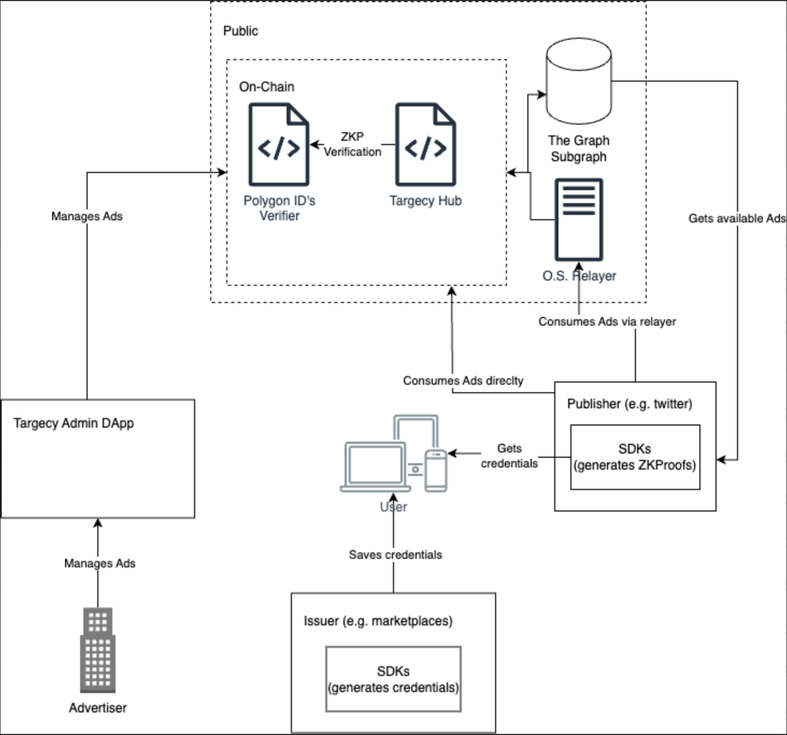

# Architecture

## Introduction

This document provides a detailed overview of the architecture of Targecy, a decentralized, non-custodial advertising protocol that prioritizes user privacy using cryptographic techniques. Targecy aims to enhance advertiser ROI while complying with privacy regulations like GDPR.

## Architecture Overview

Targecy's architecture is designed with privacy, transparency, and interoperability at its core. The system combines on-chain smart contracts, public data indexing, a web application for advertisers, optional relayer, and SDKs for publishers and credential issuers.

### On-Chain Smart Contracts (Targecy Hub)

- **Deployed on Polygon's Blockchain**: Offers low transaction fees and high throughput, ensuring scalability and great interoperability with other protocols.
- **Functions**: The contracts are the core of Targecy. Handles available Ads, Segments, Audiences, Permissions, among other entities. Also, verifies zero-knowledge proofs to ensure a fraud-free network and distributes rewards among all parties involved.

### On-Chain Data Indexing

- **Powered by The Graph**: Facilitates efficient data retrieval.
- **Benefits**: Enhances real-time analytics and user experience, enabling advertisers to monitor campaign performance and publishers to fetch relevant ads quickly.

### Web Application for Advertisers

- **Functionality**: A decentralized application (DApp) that allows advertisers to manage ad campaigns and access real-time performance metrics like impressions, clicks, and ROI. For admins to whitelist publishers, create audiences, and manage permissions. For users to view and manage their credentials.
- **Expansion Potential**: The application can evolve to include additional features such as ad generators and analytics tools.

### SDKs for Publishers and Issuers

- **Purpose**: The SDK is designed for publishers to show Ads on their sites and for credential issuers to provide custom credentials to users (e.g. visited X page).
- **Compatibility**: The initial SDK will be compatible with React and TypeScript, with plans to expand to other languages and mobile devices.

### Relayer

- **Role**: Enhances user privacy by acting as an intermediary for protocol interactions, providing anonymity. Also, it allows users to retrieve and delete their interaction history, aligning with GDPR compliance and provides a gas-less experience for users.
- **Features**: Users can engage with the advertising ecosystem without exposing their blockchain addresses or other identifying information. It also allows users to retrieve and delete their interaction history, aligning with GDPR compliance.

## Interoperability among services

All the services are connected with type-safe interfaces (when possible), which allows us to easily add new services and keep the codebase clean, maintainable, easy to use, and lower error-prone. Some frameworks used: [graphql-codegen](https://www.npmjs.com/package/@graphql-codegen/cli), [trpc](https://trpc.io/) and [typechain](https://www.npmjs.com/package/typechain).

For example, the DApp is connected to the backend/relayer via trpc, to the contracts via typechain, and to the subgraph via graphql-codegen. This allows us to easily add new features to the DApp, without having to worry about the implementation details of the other services and lowering probabilities of errors.